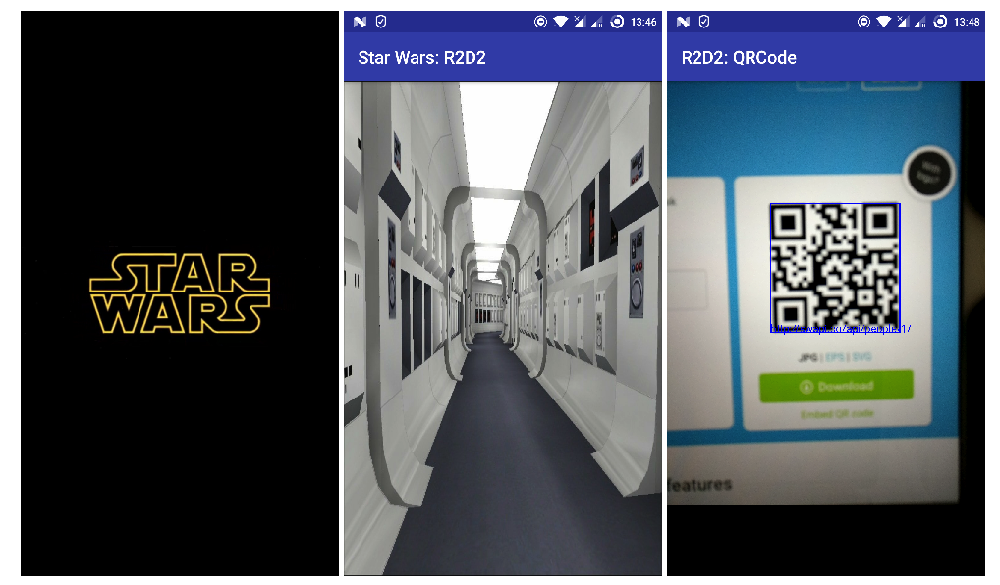
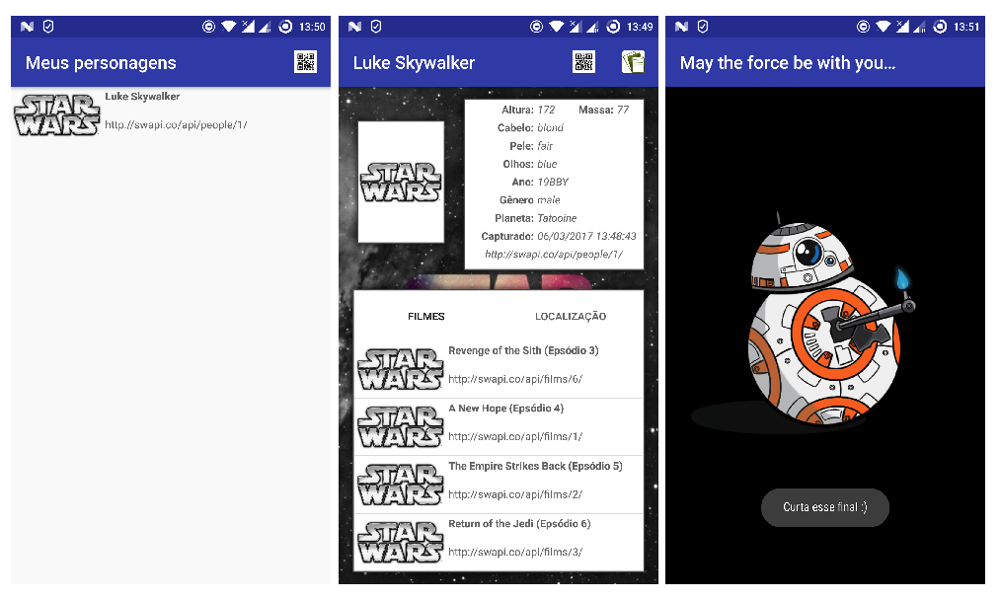

# Projeto R2D2

Um APP que irá contar um pouco da história Star Wars para você.

Projeto desenvolvido no Android usando linguagem Java.

Frameworks usados:

* Android annotations (http://androidannotations.org)
* RetroLamba (https://github.com/orfjackal/retrolambda)
* RetroFit (https://square.github.io/retrofit)
* Google Guava (https://github.com/google/guava)
* Play Services (https://developers.google.com/android/guides/overview)
* Além dos recursos nativos: Activity, IntentService, BroadcastReceiver
* E recursos para testes: Espresso e JUnit 

Conheça mais do projeto em [#1](https://github.com/emprestes/r2d2/issues/1)